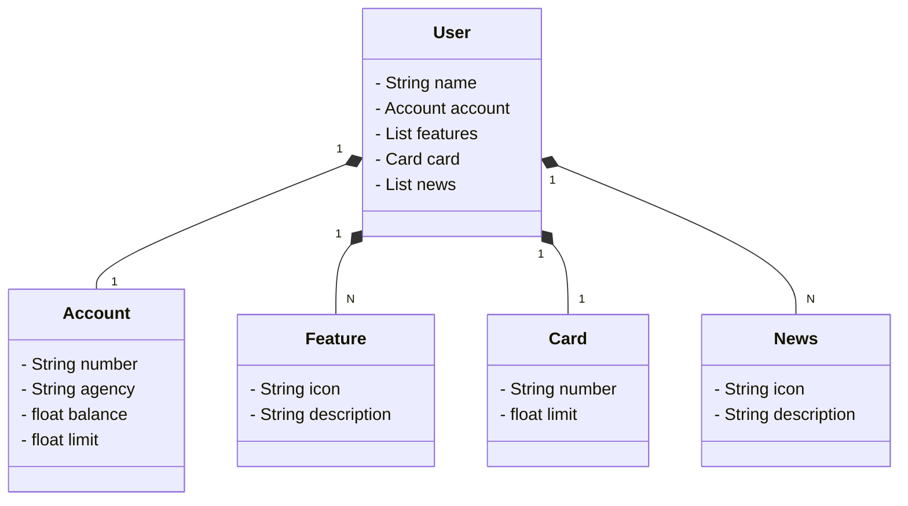

# Santander Dev Week 2024
Java RESTful API criada para a Santander Dev Week.

## Diagrama de classe


## Principais Tecnologias

- Java 21: Utilizaremos a versão LTS mais recente do Java para tirar vantagem das últimas inovações que essa linguagem robusta e amplamente utilizada oferece;
- Spring Boot 3: Trabalharemos com a mais nova versão do Spring Boot, que maximiza a produtividade do desenvolvedor por meio de sua poderosa premissa de autoconfiguração;
- Spring Data JPA: Exploraremos como essa ferramenta pode simplificar nossa camada de acesso aos dados, facilitando a integração com bancos de dados SQL;
- OpenAPI (Swagger): Vamos criar uma documentação de API eficaz e fácil de entender usando a OpenAPI (Swagger), perfeitamente alinhada com a alta produtividade que o Spring Boot oferece;
- H2 Database: Banco de dados SQL em memória.


## Links para consultar localmente o projeto:

- OpenAPI: http://localhost:8080/swagger-ui/index.html
- H2 Database: http://localhost:8080/h2-console/

## Json para o método Post no OpenAPI
```
{
	"name": "Venilton",
	"account":{
		"number": "00000000-0",	
		"agency": "0000",
		"balance": 1324.64,
		"limit": 1000.00
	},
	"features":[
	 {
		"icon": "URL",
		"description": "Descrição da Feature"
	 }
	],
	"card":{
	 "number": "xxxx xxxx xxxx 0000",
	 "limit": 1000.00
	},
	"news":[
	 {
		"icon": "URL",				
		"description": "Descrição da novidade"
	 }
	]
}
```
